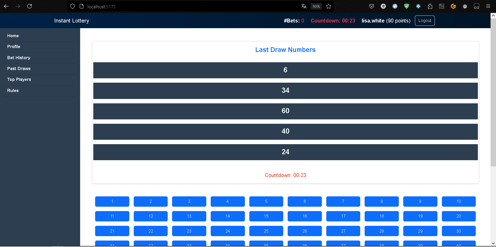
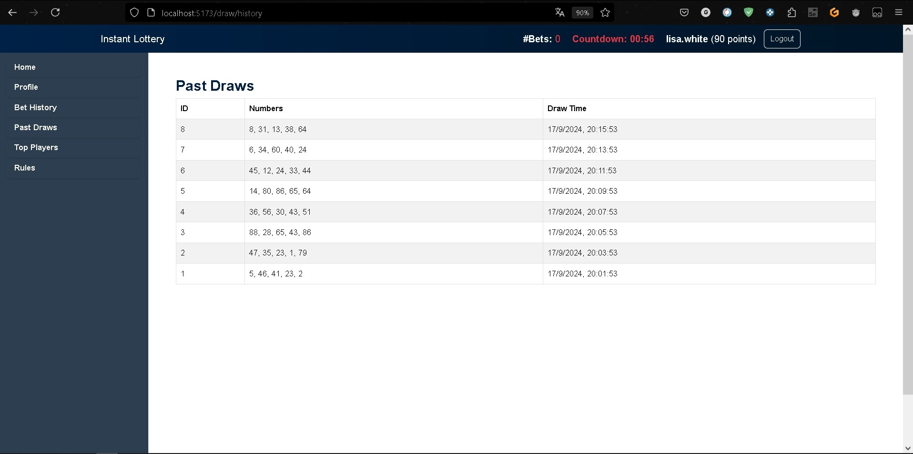
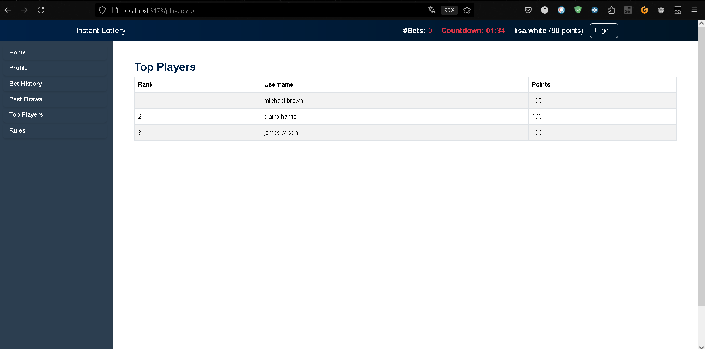
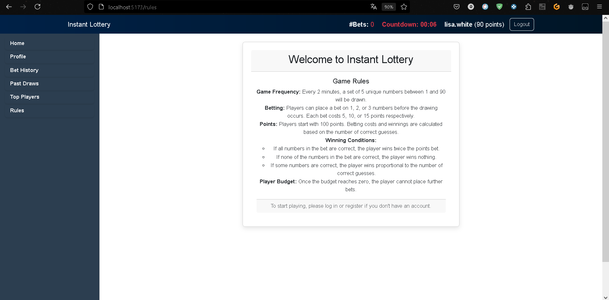
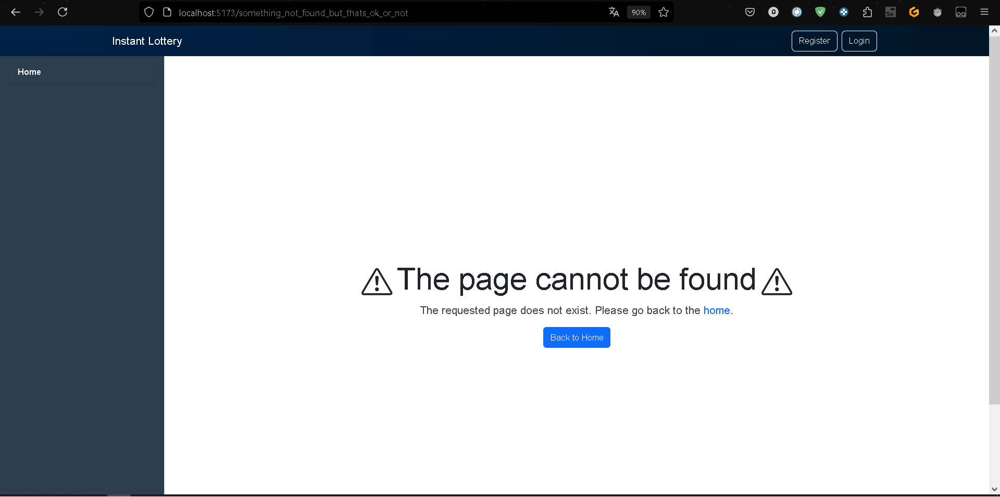

# Instant-Lottery

Grade: 31 out of 30

Course: Web Application 1

Politecnico di Torino

## Requirements
Create a web application to play an on-line version of an Instant Lottery. The game consists in a
periodic drawing (extraction) of a set of numbers, where the players may bet on some of those
numbers on each of these drawings. All website functionalities are reserved to logged-in users
(players). Non-logged users will only see a message with the rules of the game and the login form.
More in detail: every 2 minutes, the web application shows to the users a set of 5 drawn numbers in
the 1-90 range, that are distinct and randomly generated by the server. All players connected to the
web application at that moment will therefore see the same 5 numbers.
Before the drawing instant, players may place a bet on 1, 2 or 3 distinct numbers. For each drawing a
player may place at most one bet. The check on the correctly guessed numbers must be done by the
server, after the new drawing.
The bets are paid with some ‘points’ owned by the players: betting on one number costs 5 points,
betting on 2 numbers costs 10 points, and betting on 3 numbers costs 15 points. The player may
place the bet only if he/she has sufficient available points. Each player starts with an initial budget of
100 points; the budget may be increased by winning bets, only. Once the budget reaches zero, the
player can no longer place any bet.

At each drawing, three cases are possible:
1. All the numbers in the bet are correct; in this case, the application shows a suitable message
and the player wins twice the points.
2. None of the numbers in the bet is correct; in this case, the application shows a suitable
message and no points are won.
3. Some of the numbers in the bet are correct, but not all of them; in this case, the application
shows a suitable message and the player wins in proportion to the number of correct
numbers. In particular, the gain is computed according to the formula 2*(spent
points)*(correct numbers)/(played numbers).

The web application will also provide a page with the ranking of the 3 best players, ranked by
descending number of currently owned points.
The application should prevent malicious behaviors (access to private information, bets outside the
correct times, cheating on scores or on the numbers in the bet, for example) through a suitable API
design and all necessary checks.

## React Client Application Routes

- Route `/`: main access page to the website and rule page if not already logged-in
- Route `/rules`: page with rules 
- Route `/login`: page for the access, with the form for login
- Route `/register`: registration path, helps adding new users into the website and let them play
- Route `/bet/history`: path for the history of previous bets (if they have been made already)
- Route `/draw/history`: path for the draws happened before
- Route `/players/top`: brings to the list of the top 3 players in the game (with more points)
- Route `/profile`: access to the information of the user that is logged-in

## Main React Components

- `PageLayout` (in `PageLayout.jsx`): layout of the main parts of the website
- `LoginForm` (in `LoginForm.jsx`): component that offers the way to interact with the server and access to the game site (need username and password to authenticate)
- `NumberGrid` (in `NumberGrid.jsx`): grid with the numbers of the lottery. Numbers from 1 to 90, interaction made as a button pression, with feedback if pressed and status available
- `RulesPage` (in `RulesPage.jsx`): page that offers the main path of the website, and gives information of the lottery game developed
- `Profile.jsx` (in `Porfile.jsx`): component and page that offers the information of the profile. It can be reached after authentication success on the website

## API Server

### POST /api/register
- **Request Parameters**: None
- **Request Body Content**: 
  - `username` (string, required): The desired username of the user.
  - `password` (string, required): The password of the user.
- **Response Body Content**: 
  - On success: `{ message: "User registered successfully.", userId: <newUserId> }`
  - On failure: `{ error: "Error registering user." }`

### POST /api/session
- **Request Parameters**: None
- **Request Body Content**: 
  - `username` (string, required): The user's username.
  - `password` (string, required): The user's password.
- **Response Body Content**: 
  - On success: The user's information.
  - On failure: `{ errors: ["Incorrect username or password"] }`

### GET /api/session/current
- **Request Parameters**: None
- **Request Body Content**: None
- **Response Body Content**: The current authenticated user's information.

### DELETE /api/session
- **Request Parameters**: None
- **Request Body Content**: None
- **Response Body Content**: This request logs out and terminates the authenticated user's session.

### GET /api/draw
- **Request Parameters**: None
- **Request Body Content**: None
- **Response Body Content**: The latest draw in an array format. Example: `{ draw: [1, 2, 3, 4, 5] }`

### POST /api/bet
- **Request Parameters**: None
- **Request Body Content**: 
  - `numbers` (array of integers, required): The user's bet numbers (1 to 3 numbers).
- **Response Body Content**: 
  - On success: `{ correctNumbers: <number>, winnings: <number>, points: <userPoints> }`
  - On failure: `{ error: "Error message" }`

### GET /api/leaderboard
- **Request Parameters**: None
- **Request Body Content**: None
- **Response Body Content**: A list of the top 3 players sorted by points. Example: `[ { "username": "player1", "points": 200 }, ... ]`

### GET /api/user/points
- **Request Parameters**: None
- **Request Body Content**: None
- **Response Body Content**: The user's current points. Example: `{ points: 150 }`

## Database Tables

### `users`
- Stores user information.
- **Columns**:
  - `id` (integer, primary key): The user's unique identifier.
  - `username` (text): The user's unique username.
  - `password` (text): The hashed password of the user.
  - `points` (integer): The user's points (default is 100).

### `draws`
- Stores the lottery draws.
- **Columns**:
  - `id` (integer, primary key): The unique identifier for each draw.
  - `numbers` (text): A comma-separated list of the drawn numbers.
  - `draw_time` (text): The time the draw took place.

### `bets`
- **Purpose**: Stores information about bets placed by users.
- **Columns**:
  - `id` (integer, primary key): The unique identifier for the bet.
  - `user_id` (integer, foreign key): The identifier of the user who placed the bet, references `users.id`.
  - `draw_id` (integer, foreign key):  the identifier of the draw of which is referent, at the beginning it is null when the draw is concluded is populated with the draw to which it was referred, references `draws.id`.
  - `numbers` (text): The numbers bet by the user, stored as text.
  - `bet_time` (text): The date and time when the bet was placed.

## Screenshots

### Login Page

### Lottery game page

### Past draws page

### Top players

### Rules

### Page not found

## Users Credentials

- **username**: michael.brown, **password**: michaelBrown
- **username**: lisa.white, **password**: lisaWhite
- **username**: david.green, **password**: davidGreen
- **username**: claire.harris, **password**: claireHarris
- **username**: james.wilson, **password**: jamesWilson
